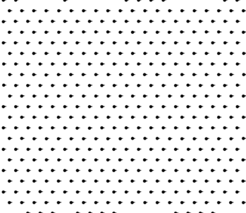

# 2次元OV模型シミュレータ

このリポジトリは、歩行者流などに適用される **2次元Optimal Velocity Model（OV模型）** に基づくシミュレーションプログラムです。

## ビルド方法

```bash
make
```

上記コマンドにより、実行可能ファイル ovm-2d-simulator が生成されます。

## 実行方法

```sh
./ovm-2d-simulator
```

実行すると、以下のファイルが生成されます：

* `frame0000.dat` 〜 `frame0400.dat`
    シミュレーション中のスナップショットを記録したデータファイルです（各ステップの座標と速度）。
* `spatio_temporal.dat`
    時空図作成用のデータファイルです。

## 可視化

### 各ステップのPNG画像の生成

Pythonスクリプトの実行には`numpy`,`pyyaml`, `matplotlib`が必要です。仮想環境などで対応してください。

```sh
python3 -m venv .venv
source .venv/bin/activate
python3 -m pip install --upgrade pip
python3 -m pip install pyyaml numpy matplotlib
```

その後、以下を実行します。

```sh
python3 render_frames.py
```

これにより、`frame*.dat` から `frame*.png` 画像ファイルが生成されます。各ファイルにはエージェントの位置（黒丸）と速度ベクトル（線）が描かれています。





### アニメーションGIFの作成

ffmpeg等でアニメーションGIFが作れます。

```sh
ffmpeg -y -i frame%04d.png animation.gif
```

### 時空図の生成

```sh
gnuplot spatio_temporal.plt
```

これにより、`spatio_temporal.dat` をもとに `spatio_temporal.png` が作成されます。


## リファレンス

実装にあたり、以下の論文を参考にしました。

* A. Nakayama, K. Hasebe, and Y. Sugiyama, "Instability of pedestrian flow and phase structure in a two-dimensional optimal velocity model", Phys. Rev. E, **71**, 6121 (2005).
    DOI: [10.1103/PhysRevE.71.036121](https://doi.org/10.1103/PhysRevE.71.036121])

## ライセンス

MIT License
